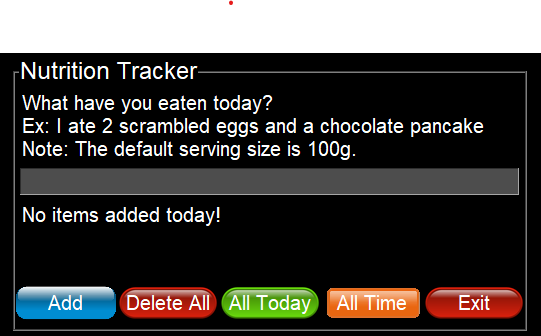
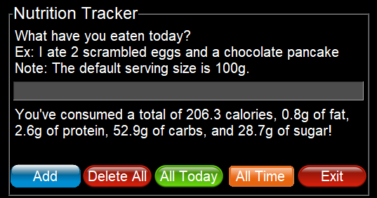
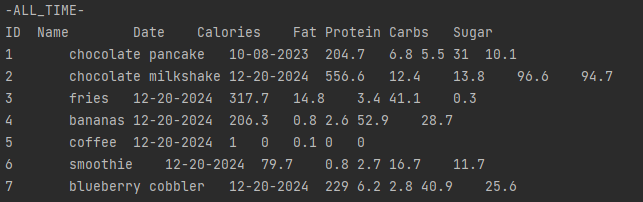

# GUI Daily Nutrition Tracker

This is a simple graphical user interface (GUI) application for tracking daily nutrition intake. It utilizes the Nutritionix API to fetch nutritional information for food items and provides features for managing and viewing nutrition data.

## Features

1. **Add Food Items**:
   - Fetch nutritional information for food items using the Nutritionix API.
   - Store the nutritional details (calories, fat, protein, carbs, sugar) in a local SQLite database.

2. **Delete All Items**:
   - Clear all stored nutrition data from the database.

3. **View Nutrition Summary for Today**:
   - Display the total nutritional intake (calories, fat, protein, carbs, sugar) for the current day.

4. **View All-Time Records**:
   - Show all recorded food items and their nutritional information in the console.

5. **Interactive GUI**:
   - Built with PySimpleGUI for an intuitive user experience.

## Tools Used

- **Python**
- **Flask**: For managing the SQLite database.
- **SQLAlchemy**: For database interactions.
- **PySimpleGUI**: For building the graphical user interface.
- **Nutritionix API**: For fetching food nutrition data.

## Screenshots






## How to Use

### 1. Prerequisites

- Python 3.x installed.
- Nutritionix API key and URL set up as environment variables:
  ```bash
  export NUTRITION_API_URL="your_api_url"
  export NUTRITION_API_KEY="your_api_key"
  ```

### 2. Installation

1. Clone the repository:
   ```bash
   git clone https://github.com/yourusername/GUIDailyNutritionTracker.git
   ```

2. Navigate to the project directory:
   ```bash
   cd GUIDailyNutritionTracker
   ```

3. Install required Python packages:
   ```bash
   pip install flask sqlalchemy requests pysimplegui pillow
   ```

4. Initialize the SQLite database:
   ```bash
   python -c "from main import db, app; app.app_context().push(); db.create_all()"
   ```

### 3. Run the Application

Start the GUI application by running:
```bash
python main.py
```

### 4. Using the GUI

- **Add Food Items**: Enter food details (e.g., "2 scrambled eggs") and click "Add".
- **Delete All**: Click "Delete All" to remove all stored data.
- **All Today**: Click "All Today" to view today's nutrition summary.
- **All Time**: Click "All Time" to display all records in the console.
- **Exit**: Click "Exit" to close the application.

## File Structure

- `main.py`: The main Python script containing the application logic.
- `daily-nutrition.db`: SQLite database file (created automatically).

## Notes

- Ensure the database file is kept secure.
- API limits may apply depending on your Nutritionix API subscription.

## License

This project is licensed under the MIT License. See the `LICENSE` file for details.
